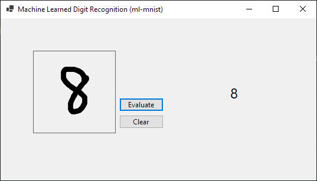

# Handwritten Digit Recognizer (ml-mnist)
---
> An implementation of a image recognition neural network for handwritten digits using the ML.NET framework.



---

### Model Statistics
  - Dataset from publicly available MNIST database
  - Trained regression model using Stochastic Dual Coordinate Ascent (non-calibrated)
    - Using Softmax and ReLU activation functions
  - Model accuracy was about 90% with a deviation of 6%
  
---

### Issues & Future Additions
  - Occasional prediction inconsistencies, likely due to bitmap preprocessing bugs
  - UI and formatting improvements to the Windows Form app
  - Improve bitmap preprocessing for better model accuracy
  - Add additional network layers for better model accuracy
  - Change to a nonlinear training method (kNN, SVM, or convolutional) to achieve 97%+ accuracy
  
---

### Development
```text
Developed by Jie "Jason" Liu (@jiejasonliu)

Contact: jasonningliu@gmail.com
```
